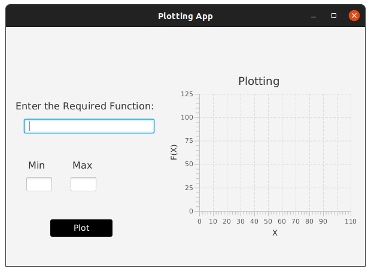
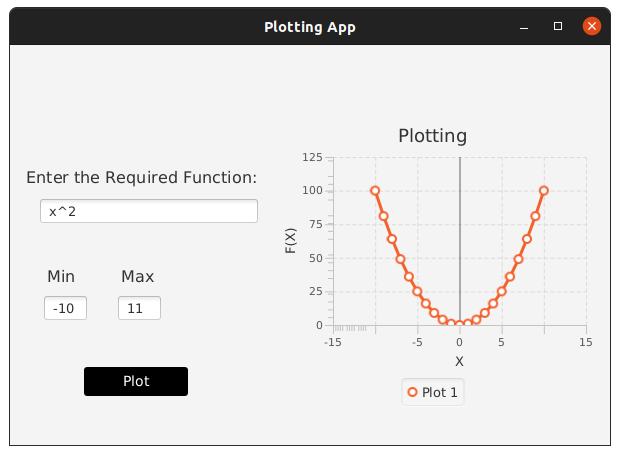

# PlottingApp
#### 
# Function Plotter

>an app to plot arbitrary user-entered function

## Functionality

- the user can define the range for the plot
- supported operators: + - / * ^
- input validation for the range and the function
- Simple GUI with nice plot

## Examples

## Running
- Please run the main function in Home.java class
